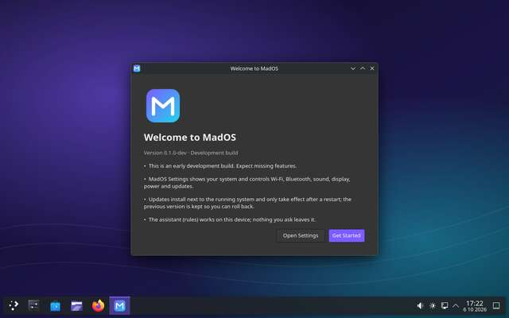

# MadOS

> **MadOS** is a working codename. Version **0.1.0-dev**: early development.
> Not for daily use. Not for physical hardware yet.

MadOS is a desktop operating system for x86_64 UEFI laptops. It is built on
the Linux kernel and Fedora's proven infrastructure (systemd, Wayland, Mesa,
PipeWire, NetworkManager, BlueZ, SELinux, bootc/OSTree), with MadOS-owned
system services and applications on top. The long-term goal is an OS with its
own shell, settings, assistant and update experience. In 0.1 the desktop is
KDE Plasma (Fedora Kinoite) as a temporary bootstrap, and this README says so.

## Current status



*First login of a development image in QEMU/KVM, captured by CI run #8: MadOS wallpaper, MadOS first-run window, KDE Plasma panel (the temporary bootstrap desktop).*

| Area | Status |
|---|---|
| Bootable container image (bootc, Fedora 44 Kinoite base) | **builds in CI** (GitHub Actions job `image`): components compile against Fedora 44, `bootc container lint` passes. Cannot be built in the bootstrap dev environment (Fedora servers blocked) |
| qcow2 disk image via image-builder | **builds in CI** |
| **Apps, audio, MadOS services in the booted VM** | **verified in CI run #7 in the development user's own session** (run #5 had shown the same inside KDE's first-boot wizard session): Konsole, Dolphin, Firefox and MadOS Settings each started and claimed their D-Bus names; sound card + PipeWire default sink present; `org.mados.System1` (real `bootc status`) and `org.mados.Assistant1` answered on the real buses; SELinux **enforcing**; network, clean reboot and shutdown. Run #5 was marked failed only because `mcelog.service` (Intel-only) failed on an AMD CI host; run #6 verified it is now skipped (no failed units) |
| **MadOS identity at boot** | **verified (runs #4, #5)**: systemd banner "Welcome to MadOS 0.1.0-dev!", KDE's first-boot screen shows "Powered by MadOS" (os-release branding) |
| **Boots in QEMU/KVM (UEFI)** | **verified in CI run #2**: `MADOS_BOOT_OK` 57 s after power-on (version 0.1.0-dev, Fedora kernel 7.2.8-200.fc44), `graphical.target` reached with **no failed units**, an active **Wayland KDE session** (KDE's first-boot wizard, found out in run #6), network up (DHCP 10.0.2.15), clean **reboot** to a second successful boot, clean **shutdown** (QEMU exit 0) |
| **Development user's desktop** | **verified in CI runs #7 and #8**: Plasma Login Manager logs `mados` in (`MADOS_SESSION_OK type=wayland class=user desktop=KDE user=mados`, about 70 s after power-on); the desktop shows the MadOS wallpaper and, at first login, the MadOS first-run window, while KDE's Welcome Center ("Welcome to Fedora!", seen in run #7) stays closed (`first_run=running kde_welcome=absent`, run #8). Fedora 44 KDE uses **Plasma Login Manager**, not SDDM; the sessions in runs #2–#5 belonged to KDE's first-boot wizard (`plasma-setup` user) |
| Installer ISO (`bootc-generic-iso`) | written, with an unattended install test (`make iso-test`); **experimental**. **Builds in CI (run #10)**, and the unattended Anaconda install from it into a VM disk **passes** (505 s). The installed system boots ("Welcome to MadOS 0.1.0-dev!" on the serial console) but did not report `MADOS_BOOT_OK` within 900 s; the cause is being diagnosed (the smoke test now prints a serial excerpt and screenshot when that happens). Run #9 had stopped earlier, building the installer environment (`autovt@.service` already exists on Fedora 44; fixed) |
| MadOS components (Rust) | 57 unit/integration tests: D-Bus policy tests on a private bus; mock NetworkManager/BlueZ/AccountsService/logind; fake and simulated bootc; real PulseAudio server |
| MadOS Settings (GTK 4) | every category has a real page (About, Network & Wi-Fi, Bluetooth, Display, Sound, Power, Storage, Users, Applications, Updates, Assistant, Privacy); verified headless against mocks/real test servers, not yet inside the VM |
| VM tooling + smoke test | verified: harness self-test (real kernel, TCG) and the MadOS image (KVM) in CI |
| Physical hardware | **untested — do not install** |

### What works (verified)

- **The MadOS image builds and boots** (GitHub Actions runs #2, #5–#8,
  QEMU/KVM, UEFI): graphical target with no failed units, SELinux enforcing,
  autologin of the development user into a Wayland Plasma session with the
  MadOS wallpaper and the MadOS first-run window (runs #7, #8), network, clean reboot and shutdown — detected by
  MadOS's own boot markers, not screenshots. Run #7 also verified, in that
  session, that the terminal, file manager, browser and MadOS Settings
  start, that audio hardware and a PipeWire sink are present, and that
  MadOS's system service and assistant work on the real system.
- `make build`, `make test`: fmt/clippy clean, 57 Rust tests, 168 static
  configuration checks, reproducibility check of generated files, QEMU
  harness self-test.
- `madosctl about` / Settings → About: real version, kernel, CPU, memory,
  GPU, storage, hostname, architecture, session, build ID (gracefully
  "Unavailable" when absent).
- Assistant: "How much battery is left?", "Why is my laptop running
  slowly?", "Check for updates" answered from real data; "Turn Bluetooth on",
  "Set the volume to 30%", "Install updates" ask for confirmation first;
  "sudo rm -rf /" is refused. Settings → Assistant → mados-ai →
  org.mados.System1 verified end to end with a simulated bootc.
- `org.mados.System1`: power and update actions are polkit-gated against the
  caller; update/rollback jobs run one at a time and report completion
  (private-bus tests, fake `bootc` executable).
- Settings pages driven headless: Network & Wi-Fi and Bluetooth (mock
  NetworkManager/BlueZ; switches always show the service's real state,
  refusals shown as "Not authorized."), Sound (real PulseAudio test server,
  cross-checked with `pactl`), Display (sysfs; brightness via logind,
  mock-tested), Users (mock AccountsService), Applications (desktop entries),
  Updates (check → install → pending restart, simulated bootc), Privacy
  (read from the running assistant).
- First-run welcome window: shown once per user, then never again.

### Implemented but unverified

On the booted image: the MadOS Plasma look-and-feel and accent colour (the
screenshot shows the wallpaper and MadOS's own windows, not a check of
Plasma's settings), and all
MadOS services against the *real* polkit, logind, NetworkManager, BlueZ,
AccountsService, PipeWire and bootc. The installer ISO.

### Not implemented yet

Account setup during install, automatic rollback, published and signed
update images (so "Check for Updates" has nothing to find yet), choosing a
Wi-Fi network, pairing Bluetooth devices, choosing sound devices, display
modes and adding users in MadOS Settings (each page says so and opens the
KDE module), assistant model providers, MadOS shell, file manager and
terminal (Dolphin and Konsole are used).

## Build

```sh
make setup     # checks prerequisites; installs nothing
make build     # MadOS components
make test      # lint + tests + config validation + harness self-test
make image     # bootable container image (root podman; needs Fedora network access)
make disk      # out/mados-<version>-<build>.qcow2
make iso       # EXPERIMENTAL installer ISO
```

Details, requirements and what each step does: [docs/development/building.md](docs/development/building.md).

## Boot it in a VM

```sh
make vm        # newest out/*.qcow2 in QEMU with UEFI (KVM if available)
make smoke     # automated boot/session/network/reboot/shutdown test
make vm-iso    # boot the installer ISO against a scratch disk in out/vm/
```

The VM never writes to the built image (copy-on-write overlay in `out/vm/`).
Development images log in automatically as `mados`; the password for
`sudo` is in `out/dev-credentials.txt`.

## Warnings

- **VM only.** Do not install MadOS on a physical machine, and do not point
  any MadOS tool at a real disk. Physical hardware testing is milestone M8.
- Development images have **autologin** and a serial console enabled
  ([docs/security.md](docs/security.md)). Never expose them to untrusted
  networks.
- No update images are published; `bootc upgrade` on an installed 0.1 system
  has nothing to fetch.

## Roadmap

M0 repository ✔ · M1 bootable VM image ✔ (qcow2; ISO experimental) ·
M2 branded desktop · M3 system services · M4 Settings · M5 assistant ·
M6 installer · M7 update/rollback · M8 physical hardware · M9 custom shell ·
M10 beta. Details: [docs/roadmap.md](docs/roadmap.md).

## Documentation

- [Architecture overview](docs/architecture/overview.md) and ADRs in `docs/architecture/`
- [Building](docs/development/building.md) · [Testing](docs/development/testing.md)
- [Hardware support](docs/hardware/support.md) · [Security](docs/security.md)
- [CLAUDE.md](CLAUDE.md) — guide for AI-assisted development sessions

## Upstream

MadOS 0.1 is a Fedora derivative. Linux, Fedora, KDE Plasma, Firefox, bootc,
osbuild and the other components listed in the
[architecture overview](docs/architecture/overview.md#upstream-dependencies-honest-inventory)
are developed by their respective projects and are not MadOS technology.

## License

MadOS source code: Apache-2.0 ([LICENSE](LICENSE)). Placeholder artwork in
`product/assets/`: CC0. Upstream components keep their own licenses.
